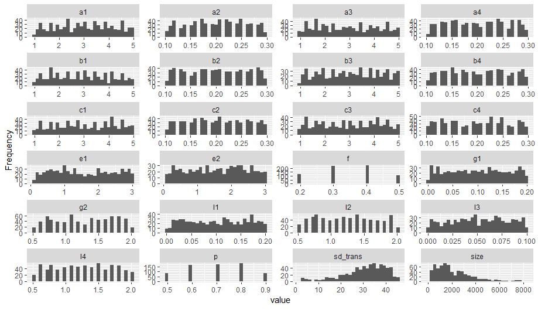

# Data_Science_ITA_kaggle
Analise de dados da base do ITA sobre drones

Link:  [https://www.kaggle.com/c/data-science-challenge-at-ita-2021-warm-up/overview]

A ideia desse projeto é testar o workflow de ML usuando o pacote tidymodel

## Histograma das variaveis

